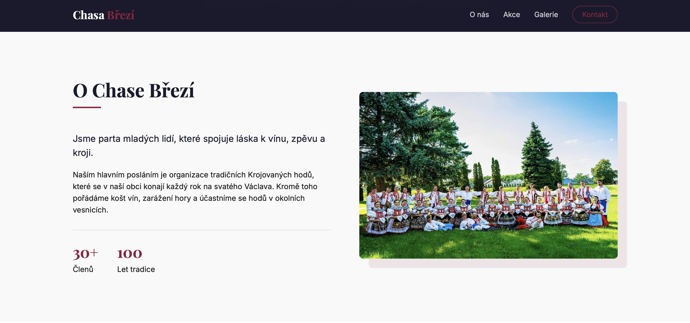

# 🍷 Chasa Březí - Oficiální webová prezentace


> Moderní, responzivní webová stránka pro folklorní spolek Chasa Březí. Cílem projektu bylo nahradit zastaralou komunikaci a vytvořit vizuálně atraktivní hub pro návštěvníky krojovaných hodů.

🔴 Živá ukázka (Live Demo): 

---

## 📸 Náhled (Screenshots)


*Úvodní sekce s moderním "Broken Grid" layoutem a fotografií chasy.*

---

## 🛠 Použité technologie

Tento projekt je postaven na čistých technologiích bez použití těžkotonážních frameworků, s důrazem na výkon a sémantiku.

* **HTML5** (Sémantická struktura, SEO optimalizace)
* **CSS3** (CSS Variables, Flexbox, CSS Grid, Media Queries)
* **JavaScript (ES6+)** (Logika odpočtu, manipulace s DOM, mobilní menu)
* **Knihovny:**
    * [LightGallery.js](https://www.lightgalleryjs.com/) - Pro interaktivní prohlížení fotek
    * [FontAwesome](https://fontawesome.com/) - Ikony

## ✨ Klíčové funkce

* **🎨 Moderní "Offset" Design:** Využití layoutu s předsazeným pozadím (Broken Grid) pro dodání hloubky fotografiím.
* **📱 Plná responzivita:** Web je optimalizovaný pro mobily, tablety i desktopy.
* **⏳ JS Odpočet:** Dynamický skript, který počítá dny, hodiny a minuty do začátku hodů.
* **🖼 Interaktivní galerie:** Lightbox efekt s možností zoomování a swipe gest na mobilu.
* **✨ Scroll Animace:** Využití `IntersectionObserver` API pro plynulé načítání obsahu při scrollování.

## 🚀 Jak spustit projekt lokálně

Jelikož jde o statický web, není potřeba instalovat žádné závislosti (npm/node).

1.  **Klonovat repozitář:**
    ```bash
    git clone [https://github.com/marekcze12/chasa-brezi.git](https://github.com/marekcze12/chasa-brezi.git)
    ```
2.  **Otevřít složku:**
    ```bash
    cd chasa-brezi
    ```
3.  **Spustit:**
    Otevři soubor `index.html` v libovolném prohlížeči, nebo použij rozšíření "Live Server" ve VS Code.

## 💡 Co jsem se naučil

Tento projekt pro mě byl příležitostí zdokonalit se v **UI/UX designu** a práci s **vanilla JavaScriptem**.
* Práce s **pseudo-elementy (`::before`)** pro vytváření pokročilých vizuálních efektů.
* Implementace externích knihoven (LightGallery) bez npm balíčků.
* Organizace CSS pomocí proměnných (`:root`) pro snadnou změnu barevného schématu.

## 📬 Kontakt

**Marek Maněk** - Junior Full Stack Developer
* Portfolio: [marekmanek.cz](https://marekmanek.cz)
* LinkedIn: [Marek Maněk]([https://linkedin.com/in/tvoje-id](https://www.linkedin.com/in/marek-maněk-5a9947339/))
* Email: marek.manek.dj@seznam.cz

---
*© 2026 Developed with ❤️ and 🍷 in South Moravia.*
